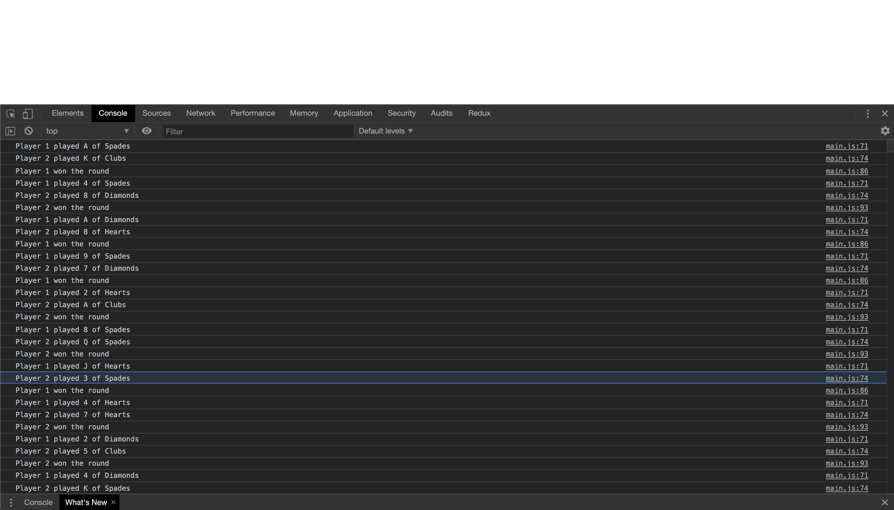

# WAR CARD GAME

A simulation of the game "war" that runs in the browser console. This game was built using object-oriented javascript.

## How to run simulation

To run the game simulation, you must first open up the console. This part of the browser interface is hidden by default, but most browsers open it when you press F12 or, on a Mac, COMMAND-OPTION-I.

make sure that you are on the console tab.

in order to rerun the simulation, refresh the page.
